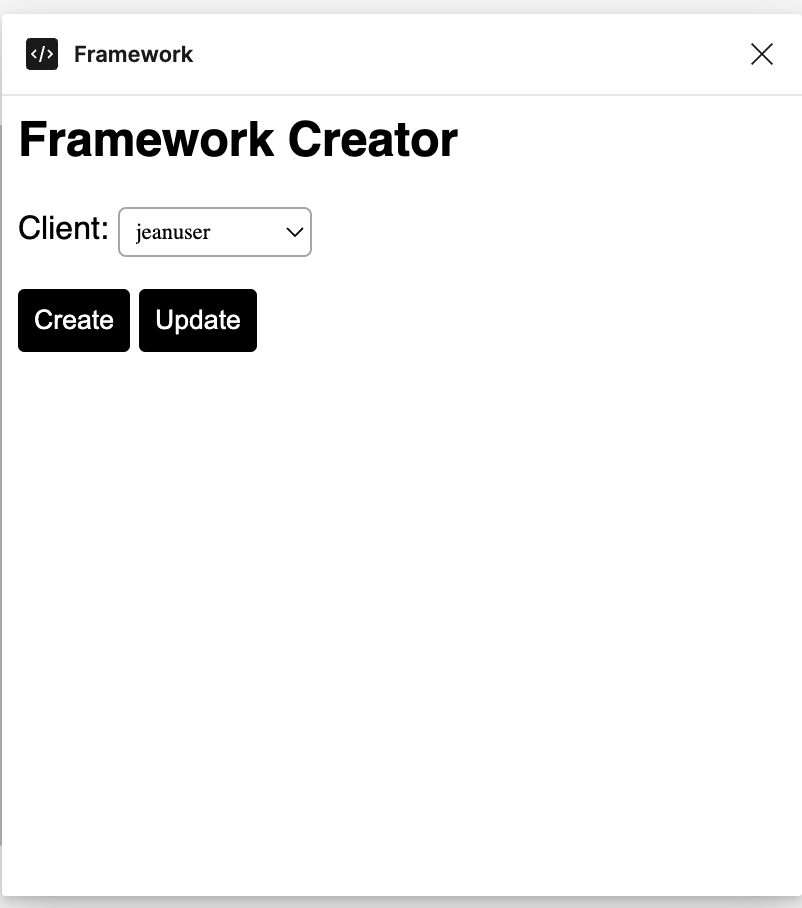
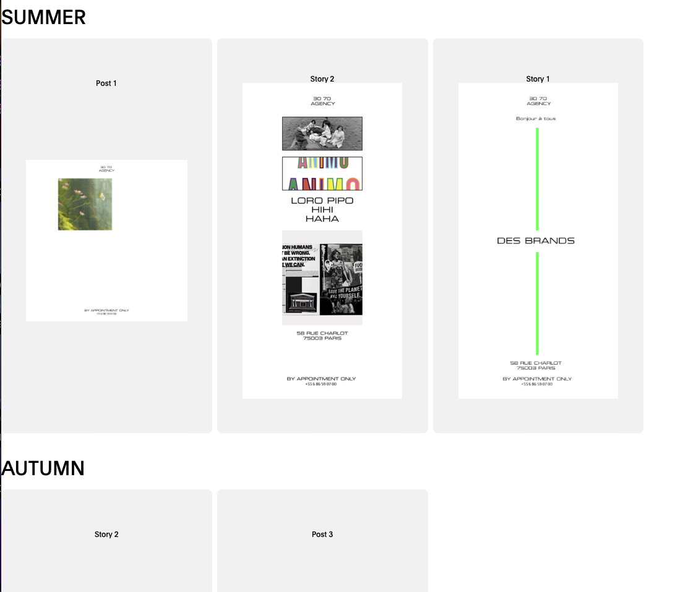
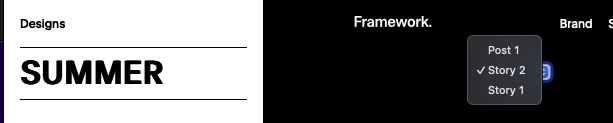
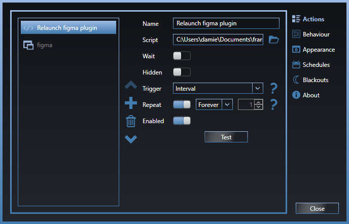
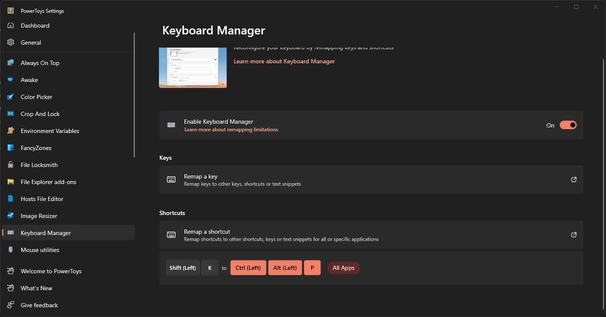

<!-- Improved compatibility of back to top link: See: https://github.com/othneildrew/Best-README-Template/pull/73 -->

<a name="readme-top"></a>

[![LinkedIn][linkedin-shield]][linkedin-url]

<!-- PROJECT LOGO -->
<br />
<div align="center">

<h3 align="center">Frame-work.app Plugin</h3>

</div>


<!-- GETTING STARTED -->

## Getting Started

The plugin does two things.
First, it allows you to create the page that you will access via frame-work.app
Second, it checks every second it change have been made, and apply them.

To add install it on your figma :

```
  Plugin => Development => Import Plugin from Manifest
  Then select manifest.json available on the folder
```

On line 1 you have to specify the adress of your backend

```
const BACKENDURL = "http://localhost:3000/api";
//const BACKENDURL = "https://framework-backend.fly.dev/api";
```

**Important**

Don't forget to install any Font that Figma will need, otherwise no change will be applied

## How it works


<br/>

Directly when you start the plugin 2 functions are launched :

- retrieveAllDatas()
- checkIfChanged()

### 1. retrieveAllDatas()

This funtion scan you Figma document and will fill this map

```js
datas = {
  FigmaName: figma.root.name,
  FigmaFileKey: figma.fileKey,
  FigmaId: figma.currentPage.id,
  sections: [],
  images: [],
  variables: [],
  usedBy: {},
};
```

#### The sections and frames

First it will retrieve all the element with a type **SECTION**.

```js
const sections = figma.currentPage.findAll(
  (section) => section.type === "SECTION"
);
```

In the exemple below, **SUMMER** and **AUTUMN** are **SECTION** in our figma file.


<br/>

Then, for every **SECTION** the plugin gonna retrieve the **FRAMES**.
This will then allow us to section specific images we want to work on.

```js
const frames = section.children;
frames.forEach((frame) => {
  const frameData = {
    type: "FRAME",
    sectionName: section.name,
    frameName: frame.name,
    frameId: frame.id,
  };
  sectionData.frames.push(frameData); // Push frame data into the section's frames array
});
```


<br/>

#### The images

We are retriving all the images that has **"EditImg"** in there name.

```js
const images = figma.currentPage.findAll((image) =>
  image.name.includes("EditImg")
);
```

### The variables

We are then storing all the variables, **STRING** and **FLOAT** and **COLOR** and **BOOLEAN**

### 2. checkIfChanged()

This is one of the most important function of the plugin. It is called every second and it makes an API call to check the flag "design.hasChanged" is set to true.

```js
if (design.hasChanged) {
  console.log("Change detected!", design);
  await makeChangement(design);
}
```

The makeChangement() function call 3 functions which are self explanatory.

```js
editVariables(design.variables);
findImgAndReplace(design.images);
settingNonVisibleEmptyText();
```

## How to make it run on a server

Because the plugin is meant to run undefinitely, you have to configure your server (Mac or Windows)

### 1. Mac

Attached you find a Apple Script. Which make the app Figma the current application.

It then mimic the keyboard touched down to reload the plug in

```
	key code 35 using {command down, option down}
```

Here the whole code

```
tell application "Figma" to activate

#repeat 2 times
repeat
	tell application "System Events"

		#Code to switch tab
		#key code 48 using control down
		delay 3
		#Code to restart plugin
		key code 35 using {command down, option down}
		delay 5
	end tell

	#Command + Option + P
end repeat
```


You then need to configure the scriptlauncher of your Mac server

```sh
nano ~/Library/LaunchAgents/com.damien.scriptlauncher.plist
```

And fill it with **com.damien.scriptlauncher.plist** file that you will find in the public folder

Then run

```sh
launchctl load ~/Library/LaunchAgents/com.damien.scriptlauncher.plist
```

### 2. Windows Configuration

Since the plugin is designed to run on a windows, you need to also to :

- Install Move Mouse to run the reloadplugin.ps1 every 30secondes
- Install PowerToy to edit a keyboard shortcut
- Configure Windows to prevent it to go to sleep/lock



<br/>


<br/>
<!-- CONTRIBUTING -->

<p align="right">(<a href="#readme-top">back to top</a>)</p>

<!-- LICENSE -->

<!-- CONTACT -->

## Contact

JRJR - [@twitter_handle](https://twitter.com/twitter_handle) - email@email_client.com

Project Link: [https://github.com/damdamtouch/Framework-generator](https://github.com/damdamtouch/Framework-generator)

<p align="right">(<a href="#readme-top">back to top</a>)</p>

<!-- MARKDOWN LINKS & IMAGES -->
<!-- https://www.markdownguide.org/basic-syntax/#reference-style-links -->

[contributors-shield]: https://img.shields.io/github/contributors/damdamtouch/Framework-generator.svg?style=for-the-badge
[contributors-url]: https://github.com/damdamtouch/Framework-generator/graphs/contributors
[forks-shield]: https://img.shields.io/github/forks/damdamtouch/Framework-generator.svg?style=for-the-badge
[forks-url]: https://github.com/damdamtouch/Framework-generator/network/members
[stars-shield]: https://img.shields.io/github/stars/damdamtouch/Framework-generator.svg?style=for-the-badge
[stars-url]: https://github.com/damdamtouch/Framework-generator/stargazers
[issues-shield]: https://img.shields.io/github/issues/damdamtouch/Framework-generator.svg?style=for-the-badge
[issues-url]: https://github.com/damdamtouch/Framework-generator/issues
[license-shield]: https://img.shields.io/github/license/damdamtouch/Framework-generator.svg?style=for-the-badge
[license-url]: https://github.com/damdamtouch/Framework-generator/blob/master/LICENSE.txt
[linkedin-shield]: https://img.shields.io/badge/-LinkedIn-black.svg?style=for-the-badge&logo=linkedin&colorB=555
[linkedin-url]: https://linkedin.com/in/linkedin_username
[product-screenshot]: images/screenshot.png
[Next.js]: https://img.shields.io/badge/next.js-000000?style=for-the-badge&logo=nextdotjs&logoColor=white
[Next-url]: https://nextjs.org/
[React.js]: https://img.shields.io/badge/React-20232A?style=for-the-badge&logo=react&logoColor=61DAFB
[React-url]: https://reactjs.org/
[Vue.js]: https://img.shields.io/badge/Vue.js-35495E?style=for-the-badge&logo=vuedotjs&logoColor=4FC08D
[Vue-url]: https://vuejs.org/
[Angular.io]: https://img.shields.io/badge/Angular-DD0031?style=for-the-badge&logo=angular&logoColor=white
[Angular-url]: https://angular.io/
[Svelte.dev]: https://img.shields.io/badge/Svelte-4A4A55?style=for-the-badge&logo=svelte&logoColor=FF3E00
[Svelte-url]: https://svelte.dev/
[Laravel.com]: https://img.shields.io/badge/Laravel-FF2D20?style=for-the-badge&logo=laravel&logoColor=white
[Laravel-url]: https://laravel.com
[Bootstrap.com]: https://img.shields.io/badge/Bootstrap-563D7C?style=for-the-badge&logo=bootstrap&logoColor=white
[Bootstrap-url]: https://getbootstrap.com
[Typescript.com]: https://img.shields.io/badge/Typescript-0769AD?style=for-the-badge&logo=jquery&logoColor=white
[Typescript-url]: https://www.typescriptlang.org
